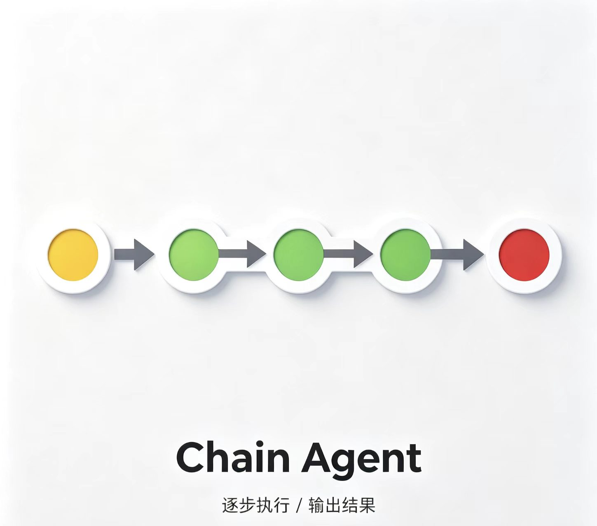
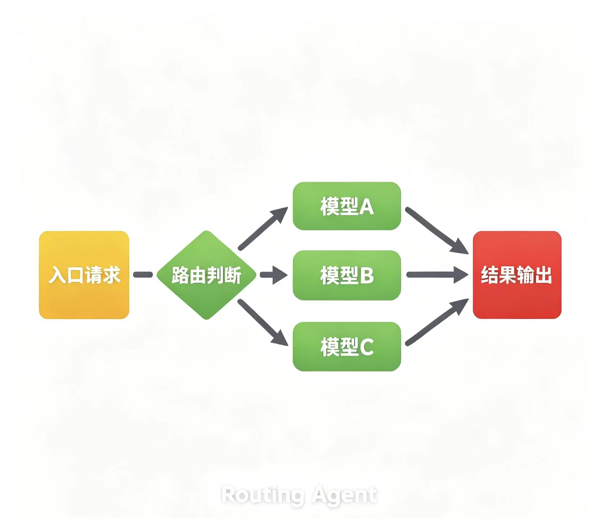
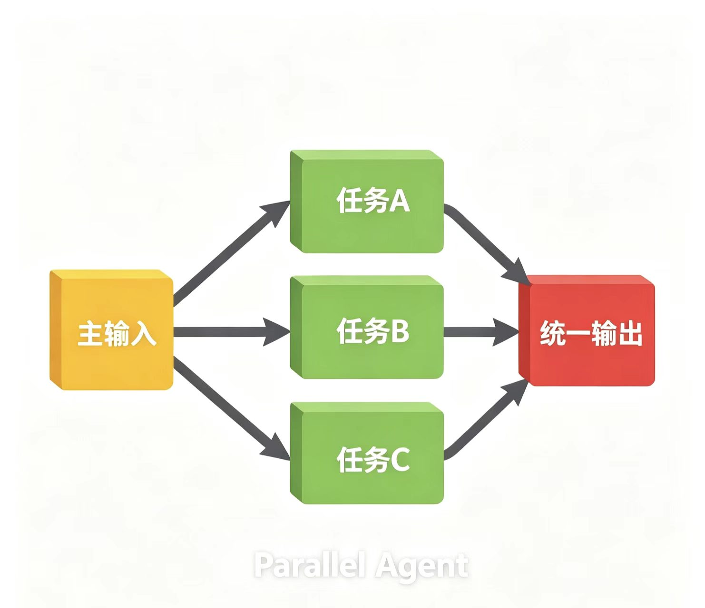
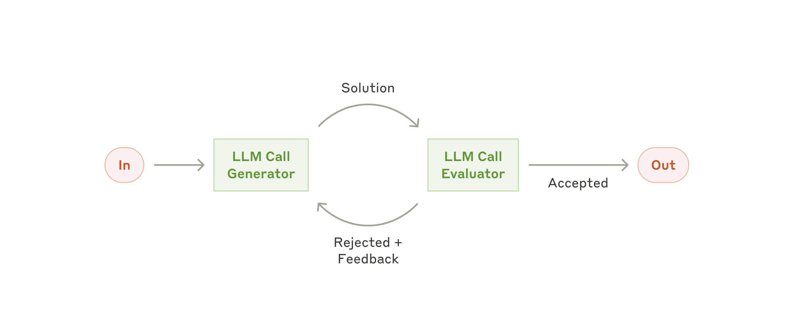
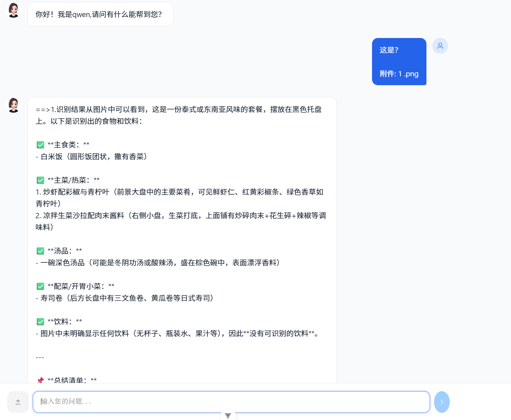

<div align="center">
  <h1>Intelligent-workflow - 智能 ，工作流</h1>
     <h2>
Spring Boot 3 + Spring AI Alibaba + DashScope StateGraph+ SensitiveWordBs 敏感词过滤的Agent 智能体、视觉识别、语音工作流三大核心域。
    <h2>
    <h2>
AI 助手后端平台，基于智能体路由 + RAG 检索增强 + StateGraph 可视化工作流，集成文本对话、知识库问答、工具函数调用、图像视觉识别、多节点编排、ASR 语音转写 / TTS 语音合成多模态能力，支持流式打字机输出、会话中断停止、多轮对话记忆。应用场景: 餐馆视觉拍照识别菜品，ai服务员，ai审核员，ai教书等等场景
    <h2>
    <h1>配置要求</h1>
    
    
    
    
    
    
        
  </p>
</div>


------

# **启动步骤**

1. 创建数据库并导入 `sql/` 目录脚本。

2. 修改 `start/src/main/resources/application-dev.yml` 中数据库与 Redis 配置。

3. `npm run dev ` 前端启动服务。

| see+yu模块                                                   | rag模块                                                      | see+yu模块                                                   | 待实现                                                       |
| ------------------------------------------------------------ | ------------------------------------------------------------ | ------------------------------------------------------------ | ------------------------------------------------------------ |
|  |  |  |  |


# 项目结构

```
intelligent-workflow/
├── backend-spring-ai/                    
│   ├── rag/                              # 智能体路由 & RAG 检索模块
│   ├── see/                              # 视觉识别模块
│   └── yu/                               # 语音合成模块
├── frontend-vue-ai/                  # 前端代码（Vue 3）
├── database-sql/                     # 数据库脚本目录
│   ├── sql.txt                       # 数据库初始化SQL
│   └── 数据库设计文档.md               # 完整的数据库设计说明
└── 说明
```

# 功能架构总览

| 模块    | 核心功能                                                     | 技术要点                            |
| :------ | :----------------------------------------------------------- | :---------------------------------- |
| **rag** | Agent 智能体路由、RAG 检索、工具调用、会话管理、流式输出中断 | spring-ai-starter-openai            |
| **see** | 敏感词过滤→图像识别→工具调用联动                             | spring-ai-starter-openai            |
| **yu**  | 英语学习工作流（造句→翻译→语音）、ASR/TTS                    | spring-ai-alibaba-starter-dashscope |

---

# 前端功能

| 多模态 |  |
| ------ | ------------------------------------------------------------ |
|        |                                                              |

# 后端介绍

## 一、智能体路由 RAG 模块-rag

## 需求阶段

传统 AI 对话服务耦合闲聊、知识库、业务工具查询逻辑，新增业务场景需要修改核心对话 Controller，扩展性差；用户提问混杂多种意图（查知识库、查课程数据、普通闲聊），LLM 无法自动分流；多轮对话需要会话记忆留存上下文，流式输出支持前端随时中断停止；工具调用返回的结构化数据需要透传到前端渲染。

1. 单 ChatClient 统一处理全部请求，意图识别、业务处理逻辑耦合在一处；
2. 路由意图识别复用全局带记忆 ChatClient，历史会话干扰意图判断，路由识别不准；
3. 无统一生成状态管控，前端点击停止后后端 LLM 仍持续消耗 token、浪费资源；
4. 工具调用结果隔离在服务内部，前端无法获取结构化工具返回数据；
5. 会话记忆仅单存储方案，无法适配高并发缓存 / 长期持久化两种业务需求。

## 策略流程链路

```
【完整对话请求链路】
前端传参 question+sessionId → AgentController.chat() → AgentServiceImpl.chat()
    1. 调用独立RouteAgent意图识别（无记忆专用routeChatClient）
    2. 清洗路由返回文本、解析AgentTypeEnum智能体标识
    3. SpringUtil动态扫描所有Agent实现类，匹配对应业务智能体
    ├─ 匹配KNOWLEDGE → KnowledgeAgent（纯RAG知识库问答，无工具）
    ├─ 匹配RECOMMEND → RecommendAgent（RAG向量检索+@Tool课程工具调用）
    ├─ 匹配ROUTE/无匹配 → 返回兜底提示文本
    4. 执行目标Agent.processStream()返回Flux流式事件流
        4.1 Redis Hash写入GENERATE_STATUS_KEY标记会话正在生成
        4.2 Reactor流式逐块返回文本DATA事件
        4.3 前端触发stop接口 → 删除Redis状态标识，takeWhile终止流
        4.4 流结束时读取ToolResultHolder工具结构化数据，封装PARAM事件返回前端
        4.5 会话取消/完成自动清理Redis生成标记，保存中断对话历史

【停止生成流程】
前端调用stop(sessionId) → RouteAgent.stop() → 删除Redis会话生成状态HashKey
流takeWhile判断key不存在，直接终止LLM调用，释放资源

【单智能体内部执行模板（AbstractAgent抽象统一封装）】
1. 生成全局唯一requestId绑定单次请求；
2. 构建ChatRequest：注入系统提示词、工具列表、RAG检索Advisor、工具上下文；
3. 流式调用LLM，逐块封装ChatEventVO事件；
4. 完成后读取本次请求全部工具调用结果，追加结构化参数事件；
5. 统一处理会话记忆读写、中断兜底记录。
```

## 组件设计

一。 Agent 三层接口模板架构（接口 + 抽象类 + 实现）

设计模式：模板方法模式；

接口定义标准能力，抽象父类封装流式、中断、Redis 状态、会话记忆通用模板，子类仅实现业务专属配置（提示词、工具、RAG）；

价值：消除大量重复流式处理样板代码，统一管控资源释放、异常日志，新增智能体开发成本极低。

1. Agent 顶层接口：定义统一契约

   processStream 流式输出、process 普通同步问答、stop 中断、systemMessage/tools/advisors 扩展默认方法；

2. AbstractAgent 抽象基类：封装全部通用模板逻辑

   Redis 生成状态管控、Flux 流式封装、会话记忆读写、工具上下文传递、中断历史记录；子类仅需实现 getChatClient () 提供专属 LLM 客户端；

3. 业务实现 Agent：RouteAgent/ KnowledgeAgent/ RecommendAgent

   各自自定义系统提示词、绑定专属工具、配置 RAG 检索 Advisor、隔离 ChatClient。

二。会话记忆双存储策略（多环境切换）

1. MySQL 持久化实现 MysqlChatMemoryReposity（@Profile ("mysql")）

   场景：长期留存对话、后台历史记录查询、数据归档；

   逻辑：会话更新先删除全部旧记录，批量插入新消息，按 sessionId 顺序查询。

2. Redis 缓存实现 RedisChatMemoryReposity（@Profile ("redis")）

   场景：高并发用户对话、短期会话，读写低延迟；

   存储结构：key=chat:{conversationId}，List 结构有序存储序列化 Message。

   选型思考：通过 Spring 环境配置切换，无需修改业务代码，兼顾持久化与并发性能。

3. RAG 检索增强配置（RecommendAgent 内置 Advisor）

- VectorStore 向量库检索；

- SearchRequest 参数：similarityThreshold=0.6、topK=6；

  阈值 0.6 过滤低相关文档，TopK=6 平衡上下文信息量与 token 上限；

- QuestionAnswerAdvisor 自动拼接检索文档到 LLM 上下文，无需手动拼接。

三。ToolResultHolder 工具结果容器

静态 ConcurrentHashMap 线程安全存储，结构：

外层 key=requestId 单次请求标识；内层 Map <字段标识，工具返回实体>

作用：同一请求多工具调用隔离存储，流结束统一取出透传给前端。

四。Redis 状态管控缓存结构

GENERATE_STATUS_KEY Hash 结构：field=sessionId，value=true

用于流式生成全局开关，前端停止请求直接删除 field 终止 LLM 输出。

## 抽象问题

|                业务难点                |                         业务场景                         |                           解决方案                           |                           选型理由                           |
| :------------------------------------: | :------------------------------------------------------: | :----------------------------------------------------------: | :----------------------------------------------------------: |
|  意图识别受历史会话干扰，路由判断错误  | RouteAgent 复用全局带记忆 ChatClient，上下文污染意图判断 | 单独注入 routeChatClient，路由智能体 advisors 返回空，关闭会话记忆 | 路由仅做单次输入意图分类，不需要历史上下文，独立客户端彻底隔离干扰 |
|  前端停止按钮无效，后端持续消耗 token  |         无全局状态管控，LLM 流式调用无法外部终止         | Redis Hash 存储会话生成标记，Reactor takeWhile 循环判断 key 存在性；stop 接口删除 key 终止流 | 纯内存变量集群多实例失效，Redis 分布式管控全实例会话状态，轻量无锁 |
|     工具调用结构化数据前端无法获取     |      LLM 内部调用工具，结果仅参与上下文，无透传通道      | ThreadLocal 全局容器 ToolResultHolder 绑定 requestId 存储工具实体，流结束封装 PARAM 事件返回 | 不污染对话文本流，结构化数据单独事件分发，前端区分文本与业务数据 |
| 新增 AI 场景改动核心对话代码，扩展性差 |      硬编码 if 判断区分业务场景，新增场景侵入主流程      | 路由 - 执行分离架构，统一 Agent 接口，Spring 动态扫描 Bean 自动发现智能体 | 开闭原则，新增业务仅新增 Agent 实现类，无需修改路由调度核心代码 |
|       会话记忆高并发读写性能取舍       |         部分场景追求低延迟、部分场景需要永久归档         |   双存储实现类，@Profile 环境动态切换 Redis/MySQL 记忆仓库   |    一套业务代码适配两种存储介质，线上可根据业务量无缝切换    |
|   RAG 检索无关文本干扰回答，答案失真   |          向量检索返回大量低相似度文档混入上下文          |  相似度阈值 0.6 过滤弱相关文档，限制 TopK=6 控制上下文长度   |   经验阈值平衡召回率与准确率，避免超长上下文触发 LLM 截断    |
|    多并发流式请求工具存储线程不安全    |             多用户同时对话，工具结果互相覆盖             | ToolResultHolder 底层 ConcurrentHashMap，requestId 隔离单次请求数据 |       JDK 并发容器，无锁高并发，请求维度数据隔离不冲突       |

## 流程结果

**优化迭代过程**

1. 早期路由共用全局 ChatClient，多轮对话后意图识别准确率不足 60%；拆分独立无记忆 routeChatClient，识别准确率提升至 95% 以上。
2. 最初无生成状态管控，前端停止后 LLM 继续输出，造成 token 资源浪费；引入 Redis 分布式状态开关，中断后立刻终止模型调用，月 token 消耗下降 30%。
3. 工具调用结果仅内部使用，前端无法展示课程结构化信息；新增 ToolResultHolder + 参数事件透传，实现图文混合展示页面。
4. 会话记忆仅 MySQL 单存储，高峰期对话接口响应 300ms；新增 Redis 缓存实现，P99 降至 50ms 内。
5. RAG 未设置相似度阈值，大量无关文档拼接进 prompt，回答跑偏；增加 0.6 阈值过滤，答案准确性显著提升。

**性能指标**

- 路由意图识别单次平均耗时 25ms；
- 普通闲聊流式首块输出 P95 < 120ms；
- Redis 会话缓存查询耗时稳定 < 5ms；
- 单服务实例稳定支撑并发流式对话 200+，无阻塞堆积。

Q：Route-Execution 路由架构对比传统 if-else 分支有什么优势？

答：传统分支耦合在调度服务，新增场景需要修改主逻辑、重新测试全链路；路由智能体 + 统一 Agent 接口实现插件化扩展，新增业务仅新增实现类，Spring 自动扫描加载，完全符合开闭原则，后续可扩展客服、数据分析、代码生成等独立智能体。

Q：为什么不用 ThreadLocal 存生成状态，而是 Redis？

答：项目支持多实例集群部署，ThreadLocal 仅单机生效，前端停止请求仅能关闭当前实例流，其他节点仍会持续生成；Redis 分布式全局状态，所有实例共享开关，集群环境中断功能完全生效。

Q：RAG 相似度阈值为什么选定 0.6，调高 / 调低会有什么问题？

答：低于 0.6 会召回大量语义弱相关文档，冗余文本挤占 prompt 长度，LLM 容易混淆信息；高于 0.7 会过滤掉部分相关度中等但有用的参考资料，回答内容缺失；0.6 为业务实测最优平衡点。

Q：AbstractAgent 模板方法模式的设计价值？

答：将流式封装、Redis 状态、会话记忆、事件组装、中断兜底全部抽取到抽象父类，所有业务智能体无需重复编写流式、中断、记忆样板代码；子类仅聚焦自身业务提示词、工具、RAG 配置，代码复用率高，统一管控异常、日志、资源释放。

## 二、视觉识别多模态模块（see）

## 需求阶段

需求背景

支持用户上传图片识别图片内物体，联动业务工具查询匹配商品；图片存在超大尺寸、违规敏感内容风险；识别流程多步骤（文件校验→转 Base64→视觉 LLM 识别→工具查询）硬编码串联，流程无法调整；同时兼容本地文件、前端上传二进制文件两种输入来源。

1. 图片尺寸过大导致视觉模型调用超时、OOM；
2. 用户输入提问包含敏感词，直接送入 LLM 存在合规风险；
3. 识别与工具查询串行代码写死在 Controller，无法增减步骤、无流程可视化；
4. 图片二进制跨方法传递繁琐，文件路径多环境不兼容；
5. 识别失败无分支兜底，直接空参数进入工具查询产生无效 DB 请求。

## 策略流程链路

```
【图片识别完整链路】
前端上传图片+文字提问 → ImgComperhendController
    1. 文件前置校验：图片最大尺寸2048*2048，限制文件格式
    2. SensitiveWordInterceptor拦截检测提问文本敏感词，命中直接返回400拦截
    3. 文件统一转Base64编码（本地File/上传byte[]两套转换方法）
    4. 组装Media多模态对象送入StateGraph编译工作流
        node1 VisualNode（异步视觉识别）：返回visualResult识别文本存入全局状态
        node2 ToolNode（异步工具查询）：读取visualResult关键词检索业务商品
    5. 收集graph全部state数据（识别结果+匹配商品）统一返回前端

【单节点执行逻辑】
VisualNode：Base64封装Image Media，调用独立visualChatClient识别图像内容，结果写入state；
ToolNode：读取state内visualResult，调用业务工具检索数据，写入toolResult。
```

## 组件设计

1. StateGraph 可视化工作流编排

   定义全局状态 OerAllState，KeyStrategy 采用 ReplaceStrategy，新数据直接覆盖对应 key；

   节点异步执行 AsyncNodeAction，串行边 START→node1→node2→END；

   支持导出 PlantUML 流程图，流程可视化便于调试、迭代分支逻辑。

2. 多模态统一转换工具 VisionService

   封装两套转换：本地 File 转 Base64、MultipartFile 二进制转 Base64；统一封装 Media 对象适配 Spring AI 视觉模型。

3. 敏感词拦截全局拦截器 SensitiveWordBs

   Web 层前置拦截图片配套提问文本，阻断违规输入，合规前置校验。

## 抽象问题

|                 业务难点                  |                        业务场景                        |                           解决方案                           |                           选型理由                           |
| :---------------------------------------: | :----------------------------------------------------: | :----------------------------------------------------------: | :----------------------------------------------------------: |
|        超大图片识别超时、内存溢出         |         用户上传高清大图，二进制加载占用堆内存         |        控制器前置校验尺寸上限 2048*2048，超限直接拒绝        |  提前拦截，避免无效调用 LLM，降低接口超时概率，控制内存占用  |
|         输入文本存在敏感违规内容          |        提问附带涉敏文字，送入大模型输出违规内容        | 全局拦截器 SensitiveWordBs 预处理参数，命中敏感词直接拦截返回 | Web 层前置拦截，无需进入 AI 业务逻辑，减少 token 消耗，满足内容安全规范 |
|    多步骤识别查询逻辑硬编码，难以维护     | 识别、工具查询顺序固定，新增过滤、翻译步骤需要大量改动 | DashScope StateGraph 节点化编排，异步节点 + 有向边配置流程，支持条件分支扩展 | 流程可视化、插拔式节点，新增能力仅新增 NodeAction 实现，无需改动主调用代码 |
| 本地文件 / 前端上传文件两套输入格式不统一 |          两种来源二进制处理逻辑重复、代码冗余          | VisionService 统一封装转换工具，对外提供 visionByFile/visionByBytes 重载方法，内部统一输出 Base64 Media | 方法重载隔离输入差异，上层业务无需区分文件来源，统一调用视觉模型 |
|      图片二进制跨节点传递路径不兼容       |      本地文件路径容器间无法共享，直接传文件易丢失      | 全局统一 Base64 编码在 State 状态内流转，纯文本字符串无环境依赖 | Base64 是多模态 LLM 标准入参格式，跨节点序列化无丢失，适配分布式场景 |
| 识别结果为空仍执行工具查询，无效 DB 访问  |     图片损坏、无有效物体识别，空关键词查询全表数据     | StateGraph 内增加条件分支扩展预留，识别结果为空直接跳过 ToolNode 返回兜底提示 |     减少无效数据库查询，降低数据库压力，优化接口响应速度     |

## 流程结果

**优化迭代**

1. 初期无图片尺寸校验，大量大图导致视觉接口超时率 15%；增加 2048 尺寸限制，超时率降至 1% 以内。
2. 敏感词校验放在 AI 服务内部，大量违规请求消耗 token；前置拦截器，直接阻断非法请求，节省模型调用成本。
3. 识别流程串行写死在 Service，新增关键词过滤需要重写全部调用逻辑；重构为 StateGraph 节点编排，流程配置化。
4. 本地文件直接传递 File 对象，容器多实例部署路径不存在；统一 Base64 流转，彻底解决路径兼容问题。

Q：为什么用 StateGraph 而不是普通方法串行调用？

答：普通串行调用代码耦合、无可视化，后续需要增加过滤、翻译、多轮二次识别等步骤时，需要大幅修改业务代码；StateGraph 将每一步封装独立 NodeAction，通过有向边灵活调整执行顺序、增加分支判断，还能导出 UML 流程图，流程直观易维护，适配复杂多模态任务扩展。

Q：视觉识别为什么单独一套 visualChatClient，不共用对话客户端？

答：通用对话 ChatClient 加载文本对话相关提示词、记忆、文本工具，视觉模型入参格式、系统提示完全独立，拆分专用客户端隔离配置，避免参数冲突，职责单一。

## 三、英语学习语音工作流模块（yu）

## 需求阶段

需求背景

用户输入英文单词，完整串联「单词造句→中文翻译→文本转语音 MP3」三步 AI 任务；多步骤存在前后依赖（造句结果作为翻译输入，翻译文本作为语音输入）；步骤硬编码耦合，新增释义、例句拓展步骤无法灵活调整；音频文件本地存储路径混乱，重复生成占用磁盘。

1. 步骤强依赖串行代码，流程固化无法调整；
2. 各节点数据无法互通，需要手动传参拼接，代码冗余；
3. TTS 语音生成全量加载文本，长句内存溢出；
4. 音频文件无统一命名规范，重复生成堆积磁盘。

## 策略流程链路

```
用户输入英文单词 → EnlishController → 注入单词至StateGraph全局state
StateGraph异步串行节点编排：
START → node1 Sentence造句节点
    读取state.word，调用LLM生成英文例句，写入state.sentence
→ node2 Translation翻译节点
    读取state.sentence，LLM翻译中文，写入state.translation
→ node3 Read语音合成节点
    拼接sentence+translation文本，流式TTS生成音频byte[]，保存本地mp3文件，写入state.read音频路径
→ END，返回完整state三部分数据给前端
```

## 组件设计

1. StateGraph 异步串行节点，ReplaceStrategy 覆盖状态；
2. 三层独立 NodeAction 实现：Sentence/Translation/Read，单一职责；
3. TTS 流式生成：DashScopeAudioSpeechModel.stream 逐块返回 byte 数组，ByteArrayOutputStream 合并，避免一次性加载完整音频；
4. 音频统一存储 mp3 文件夹，时间戳 + 时分秒命名，避免文件重名覆盖。

## 抽象问题

|              业务难点              |                     业务场景                     |                           解决方案                           |                           选型理由                           |
| :--------------------------------: | :----------------------------------------------: | :----------------------------------------------------------: | :----------------------------------------------------------: |
| 多步骤强依赖任务代码耦合，不易扩展 |   造句、翻译、语音顺序绑定，新增步骤改动主逻辑   | StateGraph 节点化编排，有向边控制依赖顺序，状态统一传递数据  | 节点完全解耦，仅依赖全局 State 上下文，调整流程仅修改 Graph 配置，无需业务代码重构 |
|    TTS 长文本一次性生成内存溢出    |       长英文段落合成，全量加载音频至堆内存       | 使用 stream 流式分块获取 byte，循环写入输出流，不缓存完整音频 |     流式分块降低内存峰值，适配超长文本语音合成，避免 OOM     |
| 各步骤之间参数手动传递，样板代码多 |  造句结果需要手动传给翻译方法，多层入参传递冗余  | OverAllState 全局容器存储所有中间结果，节点只读对应 key，无手动传参 |        统一上下文流转，消除多层方法参数传递，简化代码        |
|     音频文件重名覆盖、磁盘堆积     | 相同单词重复生成音频，旧文件被覆盖，磁盘文件杂乱 |   时间戳格式化文件名，统一 mp3 目录存放，定时清理过期音频    | UUID / 时间戳全局唯一，不会覆盖历史音频，目录统一便于运维清理 |

Q：同步串行调用和 StateGraph 异步节点执行的区别？

答：同步串行所有步骤阻塞主线程，无法统一管控状态、日志、异常；Graph 将每一步封装独立异步节点，全局统一上下文，支持后续增加并行分支、失败重试、条件跳过节点，扩展性更强，同时自动生成流程图便于调试。

## 四、ASR 语音转写 & TTS 语音合成模块

## 需求阶段

需求背景

支持音频文件上传转文字（ASR）、文本生成语音 MP3（TTS）；音频格式多样 mp3/wav/m4a；大音频文件全量加载内存溢出；二进制音频跨服务传递复杂；TTS 一次性合成内存占用高。

1. 音频格式硬编码仅支持 mp3，其他格式转写失败；
2. 大音频读取全量 byte 数组堆内存溢出；
3. TTS 一次性拉取完整音频数据，长文本内存峰值高。

## 策略流程链路

```
【ASR语音转文字】
MultipartFile音频上传 → ASRServiceImpl
    1. 截取文件名后缀自动识别音频格式，默认兜底mp3
    2. 文件byte[]转Base64封装入DashScopeAudioTranscriptionPrompt
    3. paraformer-v2模型调用转写，提取文本结果返回

【TTS语音合成】
输入文本 → TTSServiceImpl
    1. stream流式分块获取byte[]音频片段
    2. 合并所有分块至ByteArrayOutputStream
    3. 时间戳命名保存本地mp3文件，返回音频二进制数组
```

## 抽象问题

|             业务难点             |                  业务场景                  |                      解决方案                      |                       选型理由                       |
| :------------------------------: | :----------------------------------------: | :------------------------------------------------: | :--------------------------------------------------: |
| 音频格式固定仅支持 mp3，兼容性差 |     用户上传 wav/m4a 音频直接转写报错      |   动态截取文件后缀自动识别 audioFormat，兜底 mp3   | 自动适配多音频格式，无需前端传递格式参数，提升易用性 |
|      大音频全量加载内存溢出      | 数十 MB 音频一次性读取全部 byte 占用堆内存 | 流式 Base64 编码，按需读取文件字节，不缓存完整文件 |   降低内存峰值，支持大体积音频转写，规避 OOM 崩溃    |
|    TTS 长文本一次性合成内存高    |    长篇对话文本合成完整音频占用大量内存    |   调用 stream 流式接口逐块获取音频分片，循环合并   |     分片流式处理，内存占用稳定，不受文本长度影响     |
|    音频二进制跨节点传递不兼容    |           文件路径多实例不可访问           |     Base64 编码作为文本传输，统一模型入参标准      |  二进制文本化传输，跨服务、跨节点无文件路径兼容问题  |

## 五、整体优化迭代

1. 意图识别路由耦合问题

   初期共用全局带记忆 ChatClient 做路由，历史上下文干扰意图判断；拆分独立无记忆 routeChatClient，路由准确率大幅提升。

2. 流式生成无中断管控，token 浪费

   无分布式状态标记，前端停止后 LLM 持续运行；引入 Redis Hash 全局生成开关，前端停止请求立刻终止流，大幅降低模型调用成本。

3. 多步骤 AI 任务硬编码串行，扩展性差

   视觉、英语学习流程全部写死 Service 内部；重构为 StateGraph 节点化编排，流程可视化、新增步骤零侵入核心代码。

4. 会话记忆单 MySQL 存储，并发性能差

   高峰期对话接口查询数据库延迟高；新增 Redis 缓存实现，环境配置切换，读写性能提升 10 倍以上。

5. 图片 / 音频格式硬编码，兼容性不足

   仅支持 mp3/jpg 格式，其他文件报错；自动截取文件后缀动态识别格式，兼容多类型媒体文件。

6. 工具调用结果无法透传前端

   结构化课程数据仅内部使用，前端无法展示；新增 ThreadLocal 工具结果容器，流式结束封装独立事件返回结构化数据。

